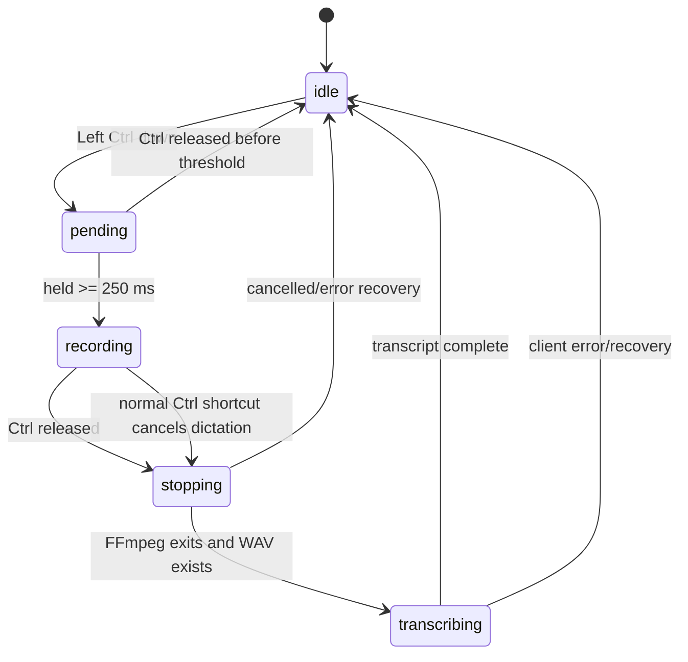

# Local Whisper Dictation V9 for macOS

A system-wide, low-latency push-to-talk dictation tool for Apple Silicon Macs.

Hold **Left Control**, speak, release it, and the recognized text is pasted back into the application and text field that were active when recording started.

The entire transcription path runs locally:

```text
Keyboard
  ↓
Hammerspoon
  ↓
FFmpeg / AVFoundation
  ↓
16 kHz mono WAV
  ↓
localhost socket client
  ↓
persistent MLX Whisper daemon
  ↓
Whisper large-v3-turbo
  ↓
Hammerspoon paste
```

The implementation is designed for repeated daily use rather than one-shot transcription. The Whisper model stays resident in memory, Hammerspoon runs a self-healing finite-state machine, and long-lived Hammerspoon objects are explicitly retained so the runtime remains stable across many consecutive dictations.

---

## Features

- System-wide push-to-talk dictation on macOS.
- Runs locally on Apple Silicon.
- Uses `mlx-community/whisper-large-v3-turbo`.
- Persistent Whisper daemon: model loads once and stays warm.
- Low-latency localhost communication.
- Chinese-first transcription with embedded English technical vocabulary.
- Short `Ctrl` taps remain normal.
- `Ctrl + key` shortcuts remain usable.
- Animated `Recording` and `Transcribing` HUD.
- Restores focus to the application/window where dictation started.
- Restores the previous clipboard after pasting.
- Self-healing state reconciliation.
- Eventtap watchdog.
- GC-safe retention of Hammerspoon watchers, timers, tasks, and HUD objects.
- Runtime health snapshot for debugging.

---

# 1. Platform requirements

Recommended environment:

- macOS
- Apple Silicon Mac (`M1` or later)
- Homebrew
- Hammerspoon
- FFmpeg
- Python 3
- `mlx-whisper`
- NumPy

This project uses MLX, so Apple Silicon is the intended platform.

---

# 2. Repository layout

```text
local-whisper-dictation-v9/
├── README.md
├── requirements.txt
├── .gitignore
├── hammerspoon/
│   └── init.lua
└── python/
    ├── whisper_daemon.py
    └── whisper_client.py
```

The three runtime files are:

```text
hammerspoon/init.lua
python/whisper_daemon.py
python/whisper_client.py
```

---

# 3. Core architecture

```mermaid
flowchart TD
    A[Left Ctrl Down] --> B[Hammerspoon eventtap]
    B --> C{Held longer than 250 ms?}

    C -- No --> D[Normal Ctrl behavior]
    C -- Yes --> E[Save current app/window]
    E --> F[Start FFmpeg AVFoundation capture]
    F --> G[Recording HUD]
    F --> H[/tmp/hammerspoon_dictation.wav]

    I[Left Ctrl Up] --> J[Hammerspoon stops recording]
    J --> K[SIGINT to FFmpeg]
    K --> L[FFmpeg finalizes WAV]
    L --> M[Transcribing HUD]

    M --> N[whisper_client.py]
    N --> O[TCP 127.0.0.1:8765]
    O --> P[Persistent whisper_daemon.py]
    P --> Q[MLX Whisper large-v3-turbo]
    Q --> R[Transcript]
    R --> N
    N --> S[Hammerspoon]
    S --> T[Restore original app/window]
    T --> U[Clipboard + Cmd+V]
    U --> V[Restore old clipboard]
```

There are four main layers.

## 3.1 Hammerspoon control layer

`hammerspoon/init.lua` is the system controller.

It handles:

- global keyboard events;
- push-to-talk detection;
- state transitions;
- normal Ctrl shortcut preservation;
- microphone process creation;
- HUD display;
- original application/window tracking;
- Whisper client invocation;
- transcript paste;
- clipboard restoration;
- task monitoring;
- runtime diagnostics.

## 3.2 Audio capture layer

FFmpeg records the microphone through macOS AVFoundation.

The target audio format is:

```text
mono
16 kHz
PCM signed 16-bit little endian
WAV
```

The output file is:

```text
/tmp/hammerspoon_dictation.wav
```

The corresponding FFmpeg command is equivalent to:

```bash
ffmpeg \
  -hide_banner \
  -loglevel error \
  -y \
  -f avfoundation \
  -i :1 \
  -ac 1 \
  -ar 16000 \
  -c:a pcm_s16le \
  /tmp/hammerspoon_dictation.wav
```

The microphone index may be different on your Mac. It is configurable in `init.lua`.

## 3.3 Persistent Whisper inference layer

`python/whisper_daemon.py` is a long-running Python process.

It loads:

```text
mlx-community/whisper-large-v3-turbo
```

once at startup and performs a warm-up inference.

After warm-up, the model remains resident in Apple unified memory.

The daemon listens only on:

```text
127.0.0.1:8765
```

and accepts small JSON requests.

This avoids paying model-load latency for every utterance.

## 3.4 Local socket client

`python/whisper_client.py` is launched by Hammerspoon for each completed recording.

It sends:

```json
{
  "cmd": "transcribe",
  "audio": "/tmp/hammerspoon_dictation.wav"
}
```

to the daemon.

The daemon returns:

```json
{
  "ok": true,
  "text": "recognized text",
  "elapsed": 0.73
}
```

The client writes:

- transcript → `stdout`
- diagnostics/latency → `stderr`

Hammerspoon pastes only stdout.

---

# 4. Finite-state machine

The Hammerspoon controller uses these states:

```text
idle
pending
recording
stopping
transcribing
```



The default hold threshold is:

```lua
local HOLD_TIME = 0.25
```

so a short Ctrl tap behaves normally.

---

# 5. Reliability architecture

V9 does not rely on a single keyboard callback being perfect.

It combines three reliability mechanisms.

## 5.1 Event-driven fast path

Normal operation is immediate:

```text
Ctrl down
  ↓
pending
  ↓
recording

Ctrl up
  ↓
stopping
  ↓
transcribing
  ↓
idle
```

No polling delay is added to the normal path.

---

## 5.2 State reconciler

A timer periodically compares:

```text
internal state
physical Ctrl state
task liveness
```

Default values:

```lua
local STATE_RECONCILE_INTERVAL = 0.10
local CTRL_RELEASE_CONFIRM_TICKS = 2
local STALE_TASK_CONFIRM_TICKS = 5
```

So:

- keyboard state is checked every 100 ms;
- a missing Ctrl release is confirmed after roughly 200 ms;
- stale task conditions are confirmed after roughly 500 ms.

The reconciler can repair:

```text
pending + physical Ctrl already released
recording + physical Ctrl already released
recording + dead FFmpeg task
stopping + FFmpeg already finished
transcribing + client already finished
unknown/corrupted state
```

---

## 5.3 GC-safe Hammerspoon runtime

Hammerspoon objects such as:

```text
hs.eventtap
hs.timer
hs.task
hs.canvas
```

must remain strongly referenced while they are in use.

V9 keeps persistent objects under a global runtime table:

```lua
LocalWhisperDictation
```

Examples:

```lua
LocalWhisperDictation.watcher
LocalWhisperDictation.stateReconciler
LocalWhisperDictation.eventtapWatchdog
LocalWhisperDictation.recordTask
LocalWhisperDictation.transcriptionTask
LocalWhisperDictation.whisperDaemonTask
LocalWhisperDictation.hud
LocalWhisperDictation.pulseTimer
```

This makes their intended lifetime explicit.

---

## 5.4 Eventtap watchdog

A separate timer periodically verifies that the Hammerspoon keyboard watcher is still enabled.

If necessary, it restarts the watcher.

---

## 5.5 Critical timer error resilience

Critical repeating timers use:

```lua
hs.timer.new(interval, callback, true)
```

The `true` enables continuation after callback errors, so a single Lua exception does not permanently disable the reconciler/watchdog.

---

# 6. Recording and transcription HUD

When recording:

```text
● Recording
  HOLD CTRL • LOCAL WHISPER
```

The HUD uses a red center dot with animated pulse rings.

When transcription begins:

```text
✦ Transcribing…
  MLX • LARGE-V3-TURBO
```

The animation changes to an amber pulse.

The HUD is implemented with `hs.canvas`.

---

# 7. Clipboard and focus handling

Before recording, Hammerspoon records the current:

```text
frontmost application
focused window
```

Before pasting, it saves the current clipboard.

After transcription:

1. the internal dictation state returns to `idle`;
2. the transcript is written to the clipboard;
3. the original app is activated;
4. the original window is focused;
5. Hammerspoon sends `Cmd+V`;
6. the previous clipboard contents are restored.

This allows dictation to work in ordinary editable fields without requiring a custom plugin for each application.

---

# 8. Whisper configuration

The default model is configured in:

```python
MODEL = "mlx-community/whisper-large-v3-turbo"
```

The daemon currently uses:

```python
language="zh"
temperature=0.0
```

This configuration is aimed at primarily Chinese speech with embedded English technical terms.

To use another MLX Whisper checkpoint, change:

```python
MODEL = "..."
```

in:

```text
python/whisper_daemon.py
```

---

# 9. Initial prompt

The current daemon uses a compact domain-context prompt.

Example:

```python
INITIAL_PROMPT = (
    "我们讨论 KV cache compression、FlashAttention、quantization、rate allocation、"
    "achievability、converse、AirComp 和 LLM inference。"
    "这个问题有什么核心 insight？我们需要把数学直觉表达得清楚、自然。"
)
```

Whisper's `initial_prompt` is best treated as decoder context, not as a long instruction document.

Keep it short and representative of the vocabulary you actually speak.

---

# 10. Terminology normalization

The daemon also performs deterministic normalization for predictable spelling/capitalization variants.

Example:

```python
REPLACEMENTS = {
    "KVCache": "KV cache",
    "KV Cache": "KV cache",
    "Flash Attention": "FlashAttention",
    "Air Comp": "AirComp",
    "overleaf": "Overleaf",
    "hammer spoon": "Hammerspoon",
    "LLm": "LLM",
    "Gpu": "GPU",
}
```

This is useful for errors that do not require another neural decoding pass.

---

# 11. Installation

## 11.1 Install Homebrew

If Homebrew is not installed, install it from:

https://brew.sh/

---

## 11.2 Install Hammerspoon and FFmpeg

```bash
brew install --cask hammerspoon
brew install ffmpeg
```

Optional explicit Python installation:

```bash
brew install python@3.12
```

The development setup for this project uses Python 3.12.

---

## 11.3 Create a Python virtual environment

```bash
mkdir -p ~/.venvs
python3.12 -m venv ~/.venvs/mlx-whisper
```

Activate it:

```bash
source ~/.venvs/mlx-whisper/bin/activate
```

Upgrade pip:

```bash
python -m pip install --upgrade pip
```

Install dependencies from the repository:

```bash
pip install -r requirements.txt
```

Equivalent direct install:

```bash
pip install mlx-whisper numpy
```

Verify:

```bash
python -c "import mlx_whisper, numpy; print('MLX Whisper environment OK')"
```

Exit the environment when desired:

```bash
deactivate
```

Re-enter later with:

```bash
source ~/.venvs/mlx-whisper/bin/activate
```

---

# 12. Find your microphone index

List AVFoundation devices:

```bash
ffmpeg -f avfoundation -list_devices true -i ""
```

You should see entries similar to:

```text
AVFoundation audio devices:
[0] Some Microphone
[1] MacBook Pro Microphone
```

If your microphone is index `1`, use:

```lua
local AUDIO_DEVICE = ":1"
```

in `hammerspoon/init.lua`.

The format is:

```text
<video device>:<audio device>
```

so:

```text
:1
```

means:

```text
no video device
audio device 1
```

---

# 13. Install the runtime files

Create the Hammerspoon directory:

```bash
mkdir -p ~/.hammerspoon
```

Copy the Python files:

```bash
cp python/whisper_daemon.py ~/.hammerspoon/whisper_daemon.py
cp python/whisper_client.py ~/.hammerspoon/whisper_client.py
```

Back up your existing Hammerspoon config if present:

```bash
cp ~/.hammerspoon/init.lua ~/.hammerspoon/init.lua.backup 2>/dev/null || true
```

Install V9:

```bash
cp hammerspoon/init.lua ~/.hammerspoon/init.lua
```

---

# 14. Verify paths in `init.lua`

Open:

```text
~/.hammerspoon/init.lua
```

The default configuration expects:

```lua
local FFMPEG = "/opt/homebrew/bin/ffmpeg"

local WHISPER_PYTHON =
    HOME .. "/.venvs/mlx-whisper/bin/python"

local WHISPER_DAEMON =
    HOME .. "/.hammerspoon/whisper_daemon.py"

local WHISPER_CLIENT =
    HOME .. "/.hammerspoon/whisper_client.py"
```

Check FFmpeg:

```bash
which ffmpeg
```

On a normal Apple Silicon Homebrew installation this is usually:

```text
/opt/homebrew/bin/ffmpeg
```

If yours differs, update `FFMPEG`.

Also update:

```lua
local AUDIO_DEVICE = ":1"
```

to match your microphone index.

---

# 15. macOS permissions

Open:

```text
System Settings
→ Privacy & Security
```

Hammerspoon should be allowed where required for:

```text
Accessibility
Input Monitoring
```

The microphone recording chain must also have microphone permission.

macOS may prompt for these permissions on first use.

If keyboard capture or automatic paste does not work, verify these permissions first.

---

# 16. Start the project

Open Hammerspoon.

Select:

```text
Hammerspoon menu
→ Reload Config
```

You should see:

```text
Local Whisper Dictation V9 Ready
```

If the Whisper daemon is not already running, Hammerspoon starts it.

The first model load may take longer because the model may need to be downloaded and cached.

After warm-up, subsequent dictations use the already-resident model.

---

# 17. Verify the daemon

Check the local service:

```bash
printf '{"cmd":"ping"}\n' | nc 127.0.0.1 8765
```

Expected response:

```json
{
  "ok": true,
  "status": "ready",
  "model": "mlx-community/whisper-large-v3-turbo"
}
```

---

# 18. Usage

## Dictate

Hold:

```text
Left Control
```

for at least:

```text
250 ms
```

Speak while the HUD shows:

```text
Recording
```

Release Control.

The HUD changes to:

```text
Transcribing…
```

The recognized text is pasted into the original application.

---

## Short Ctrl tap

A quick Ctrl press/release does not begin recording.

---

## Ctrl shortcuts

If another key/modifier is used with Ctrl, the dictation path is cancelled so normal Ctrl shortcuts can continue to work.

---

# 19. Runtime diagnostics

Open:

```text
Hammerspoon → Console
```

Run:

```lua
hs.inspect(LocalWhisperDictation.snapshot())
```

A healthy idle state should look similar to:

```lua
{
  version = "V9",
  state = "idle",
  ctrlDown = false,
  physicalCtrl = false,
  watcherEnabled = true,
  reconcilerRunning = true,
  eventtapWatchdogRunning = true,
  recordingTaskRunning = false,
  transcriptionTaskRunning = false
}
```

This is the main Hammerspoon diagnostic command.

---

# 20. Useful process commands

Show relevant processes:

```bash
ps -axo pid,ppid,state,%cpu,rss,etime,command \
  | egrep -i 'ffmpeg|whisper_daemon|whisper_client' \
  | grep -v egrep
```

Find the daemon:

```bash
pgrep -af whisper_daemon.py
```

Stop the daemon:

```bash
pkill -f whisper_daemon.py
```

Gracefully stop an active FFmpeg recording:

```bash
pkill -INT -f 'ffmpeg.*hammerspoon_dictation.wav'
```

Prefer `SIGINT` over `kill -9` so FFmpeg can finalize the WAV file.

---

# 21. Daemon logs

The daemon writes diagnostic information to:

```text
/tmp/local-whisper-daemon.log
```

Follow it live:

```bash
tail -f /tmp/local-whisper-daemon.log
```

---

# 22. Updating the Python daemon

Because `whisper_daemon.py` is persistent, changing the source file does not change the currently running process.

After modifying:

```text
~/.hammerspoon/whisper_daemon.py
```

restart it:

```bash
pkill -f whisper_daemon.py
```

Then:

```text
Hammerspoon → Reload Config
```

The model will warm up again.

---

# 23. Updating `init.lua`

Back up the current config:

```bash
cp ~/.hammerspoon/init.lua ~/.hammerspoon/init.lua.backup
```

Install the new one:

```bash
cp hammerspoon/init.lua ~/.hammerspoon/init.lua
```

Then:

```text
Hammerspoon → Reload Config
```

V9 performs cleanup of persistent watchers/timers before rebuilding the runtime.

---

# 24. Troubleshooting

## Ctrl does nothing

In Hammerspoon Console:

```lua
hs.inspect(LocalWhisperDictation.snapshot())
```

Check:

```text
watcherEnabled = true
reconcilerRunning = true
eventtapWatchdogRunning = true
```

Also check macOS Accessibility/Input Monitoring permissions.

---

## Recording does not stop

Check physical modifiers:

```lua
hs.inspect(hs.eventtap.checkKeyboardModifiers())
```

If no modifier is pressed, the result should normally be:

```lua
{}
```

Then inspect:

```lua
hs.inspect(LocalWhisperDictation.snapshot())
```

The state reconciler should automatically repair a missed Ctrl release.

---

## Whisper daemon is unavailable

Test:

```bash
printf '{"cmd":"ping"}\n' | nc 127.0.0.1 8765
```

If unavailable, inspect:

```bash
tail -100 /tmp/local-whisper-daemon.log
```

You can also run the daemon manually:

```bash
source ~/.venvs/mlx-whisper/bin/activate
python ~/.hammerspoon/whisper_daemon.py
```

This exposes Python/import/model errors directly in the terminal.

---

## Microphone recording fails

List AVFoundation devices again:

```bash
ffmpeg -f avfoundation -list_devices true -i ""
```

Verify the configured audio index.

Also verify macOS microphone permission.

---

## Text is inserted twice

Check whether another application uses the same push-to-talk shortcut.

For example, if both:

```text
Local Whisper Dictation
ChatGPT desktop dictation
```

are bound to `Ctrl`, both may independently insert recognized text.

Use different shortcuts.

---

## Technical vocabulary is inconsistent

For simple capitalization/spacing differences, update:

```python
REPLACEMENTS
```

For vocabulary recognition bias, update:

```python
INITIAL_PROMPT
```

Keep the prompt compact.

---

# 25. Memory and background behavior

The daemon intentionally keeps Whisper resident in unified memory.

When idle:

```text
Whisper model remains loaded
no transcription is running
socket waits for requests
```

Therefore the main idle cost is memory occupancy, not continuous inference.

On a 16 GB Mac, use:

```text
Activity Monitor
→ Memory
→ Memory Pressure
```

as the primary signal.

If memory pressure remains green, keeping the model resident is generally appropriate for an interactive dictation workflow.

---

# 26. Offline behavior

After:

- Python packages are installed;
- FFmpeg/Hammerspoon are installed;
- the MLX Whisper model is already downloaded and cached;

the transcription path is local.

The runtime request path is:

```text
Hammerspoon
  ↓
127.0.0.1
  ↓
local Python daemon
  ↓
local MLX inference
```

No remote transcription API is required.

---

# 27. Important configuration knobs

## Push-to-talk hold threshold

```lua
local HOLD_TIME = 0.25
```

Increase it if normal Ctrl usage accidentally starts dictation.

---

## Microphone device

```lua
local AUDIO_DEVICE = ":1"
```

Set this using the AVFoundation device listing.

---

## Reconciler interval

```lua
local STATE_RECONCILE_INTERVAL = 0.10
```

Default: 100 ms.

---

## Missed-release confirmation

```lua
local CTRL_RELEASE_CONFIRM_TICKS = 2
```

At a 100 ms reconciler interval:

```text
2 ticks ≈ 200 ms
```

---

## Stale-task confirmation

```lua
local STALE_TASK_CONFIRM_TICKS = 5
```

At a 100 ms interval:

```text
5 ticks ≈ 500 ms
```

---

## Whisper model

```python
MODEL = "mlx-community/whisper-large-v3-turbo"
```

---

## Language

```python
language="zh"
```

---

## Client timeout

In `whisper_client.py`:

```python
TIMEOUT = 20.0
```

Increase this if exceptionally long utterances regularly exceed the client timeout.

---

# 28. Security / privacy notes

The daemon binds to:

```text
127.0.0.1
```

not to all network interfaces.

Audio is temporarily written to:

```text
/tmp/hammerspoon_dictation.wav
```

The next recording replaces/removes the previous temporary recording.

For more privacy-sensitive deployments, the audio-file lifecycle can be tightened further by explicitly deleting the WAV immediately after successful transcription.

---

# 29. Quick installation checklist

```bash
# Dependencies
brew install --cask hammerspoon
brew install ffmpeg python@3.12

# Python environment
mkdir -p ~/.venvs
python3.12 -m venv ~/.venvs/mlx-whisper
source ~/.venvs/mlx-whisper/bin/activate
pip install --upgrade pip
pip install -r requirements.txt

# Hammerspoon runtime files
mkdir -p ~/.hammerspoon
cp python/whisper_daemon.py ~/.hammerspoon/
cp python/whisper_client.py ~/.hammerspoon/
cp hammerspoon/init.lua ~/.hammerspoon/init.lua

# Find microphone device
ffmpeg -f avfoundation -list_devices true -i ""
```

Then:

1. edit `AUDIO_DEVICE` in `~/.hammerspoon/init.lua`;
2. grant Hammerspoon/macOS permissions;
3. open Hammerspoon;
4. Reload Config;
5. wait for Whisper warm-up;
6. hold Left Ctrl and dictate.

Daemon check:

```bash
printf '{"cmd":"ping"}\n' | nc 127.0.0.1 8765
```

Hammerspoon health check:

```lua
hs.inspect(LocalWhisperDictation.snapshot())
```

---

# 30. Design summary

The project is intentionally split into three components:

```text
Hammerspoon
    owns interaction + state

FFmpeg
    owns microphone capture

MLX Whisper daemon
    owns speech inference
```

The performance design is:

```text
persistent model
+ local socket
+ direct PCM WAV loading
```

The reliability design is:

```text
event-driven fast path
+ physical/task state reconciler
+ eventtap watchdog
+ GC-safe persistent runtime references
```

Together these provide a small, local, responsive dictation layer that can be used across ordinary macOS applications.
